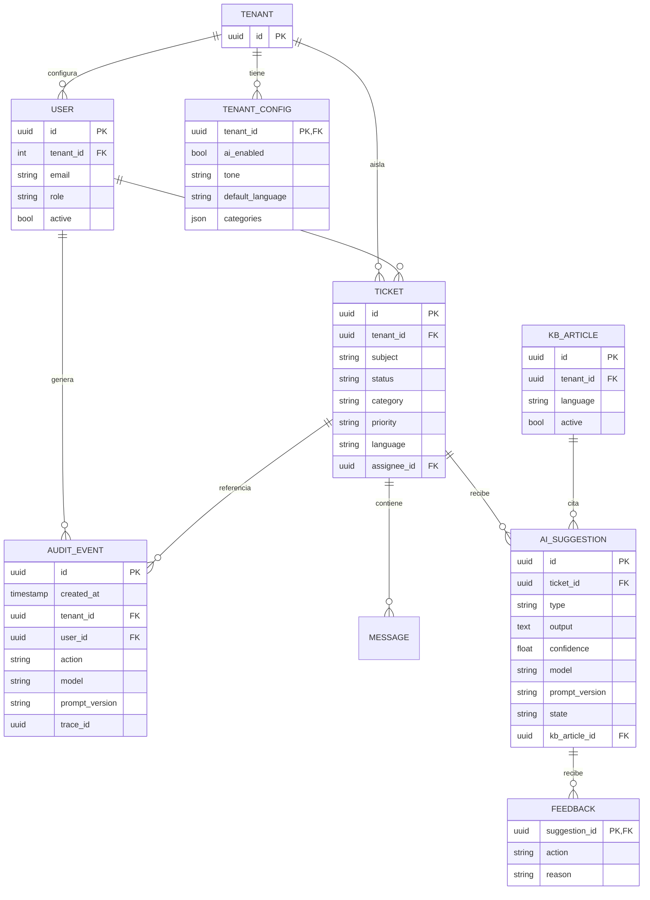

# 03 · Modelo de datos y diccionario de campos

> Trazable a `spec.md` §4, §9 y §11. En SQLAlchemy 2.x. Clasificación de PII por campo.

## 1. Entidades

## 2. Diccionario de campos y clasificación de PII

Clasificación: **CRÍTICA** (requiere redacción/tokenización antes de LLM), **SENSIBLE** (minimizada, con control de acceso), **INTERNO** (operación), **PÚBLICO/config** (sin datos personales).

### Tenant / User

| Campo | Tipo | PII | Notas |
|---|---|---|---|
| tenant.id | uuid | NO | PK, alcance de dato siempre filtrado |
| user.id | uuid | NO | PK global |
| user.email | string | **CRÍTICA** | Identifica persona; redactar a no ser necesaria en audit (hash) |
| user.role | enum | NO | §10.3 RBAC |

### Ticket

| Campo | Tipo | PII | Notas |
|---|---|---|---|
| ticket.id | uuid | NO | PK |
| ticket.tenant_id | uuid | NO | Filtro obligatorio en toda query |
| ticket.subject | string | **SENSIBLE** | Contenido describe caso |
| ticket.description | text | **CRÍTICA** | Puede contener PII: se redacta antes de LLM |
| ticket.category | string | NO | Clasificación |
| ticket.language | string | NO | ISO 639-1 |
| ticket.priority | enum | NO | high/medium/low |
| ticket.assignee_id | uuid FK | NO | operativo |
| message.id | uuid | NO | — |
| message.body | text | **CRÍTICA** | redactar antes de remitir a IA |

### Suggestion / Feedback / Audit

| Campo | Tipo | PII | Notas |
|---|---|---|---|
| suggestion.output | text | **SENSIBLE** | Puede contener fragmentos del ticket; almacenar mínimos |
| suggestion.confidence | float | NO | Umbral de advertencias (FR-07) |
| suggestion.model + prompt_version | string | NO | Trazabilidad FR-09 |
| feedback.action | enum | NO | accepted/edited/rejected/flagged |
| feedback.reason | text | SENSIBLE | Libre, puede mencionar cliente; registrarlo |
| audit.trace_id | uuid | NO | correlación externa |
| audit.action | string | NO | §11.1 |
| audit.prompt_version | string | NO | ID de plantilla usada |

## 3. Restricciones de integridad y reglas

- **filtro tenant obligatorio**: cada tabla que referencia a tenant requiere `WHERE tenant_id = :current` aplicado vía repositorio central (no el call site) (ADR-001). Se planifica RLS.
- **suggestion.state** ∈ `pending | accepted | edited | rejected | flagged`.
- Un `feedback` sólo se puede registrar contra una sugerencia del mismo tenant.
- `audit_event.created_at` siempre UTC; no se altera posteriormente (inmutabilidad de auditoría).

## 4. Pendientes (requieren decisión)

- ¿Hash/anonimización de `user.email` en audit? **Propuesto: hash con salt** — requiere OK.
- Retención por campo (ver §4 de política): por definir valores por tenant.
- ¿Blockchain/tamper-evident en audit? **Propuesto: off (v1)** — requiere OK.